# Movilidad

← [Índice](./README.md) | ← [General](./01-general.md)

## Arena y estructura de las pistas

### Layout general de la arena

La arena se organiza en varias "secuencias" temáticas: aproximación
urbana, aproximación semi-colapsada, acceso a vivienda, y búsqueda en
vivienda (laberinto). Cada una agrupa terrenos y obstáculos
específicos — ver más abajo el detalle de cada uno.

  <figure>
    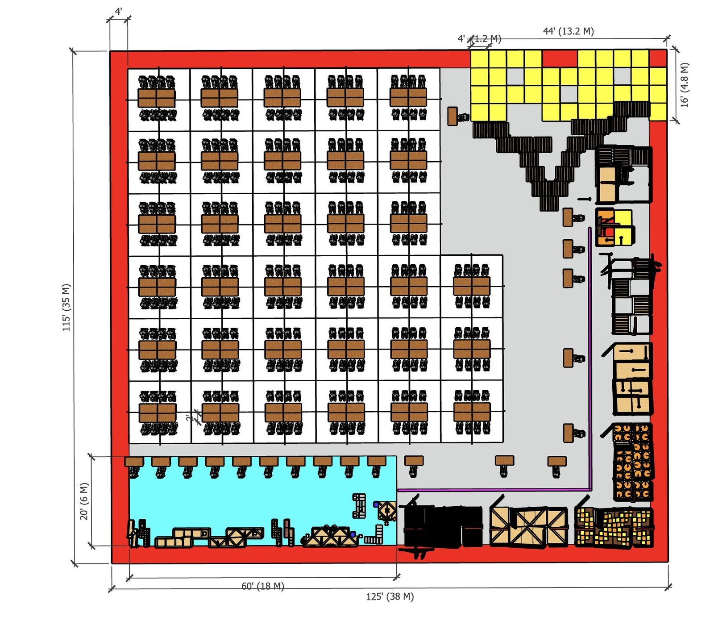
    <figcaption>
      <b>Figura 2.1</b> — Arena Layout 2026: 125 × 115 ft (38 × 35 m). Los carriles de las secuencias quedan en el borde derecho e inferior, la zona RMRC en cian abajo a la izquierda y una zona amarilla de 44 × 16 ft arriba a la derecha. 
      <i>Fuente: Rules 2026D, p. 2</i>
    </figcaption>
  </figure>

🚩 **PENDIENTE:** las dimensiones exactas de la arena completa (125 x
115 pies según el PDF de referencia) probablemente no aplican tal cual
para la arena de TMR, que seguramente es más pequeña. Confirmar
dimensiones reales del venue de TMR.

### Estructura de un carril individual

Un carril individual mide aproximadamente 2.4m x 4.8m, con zonas de
inicio/fin en ambos extremos, una sección central ("crossover"), y
puntos de tareas lineales/omni embebidos en el trayecto.

  <figure>
    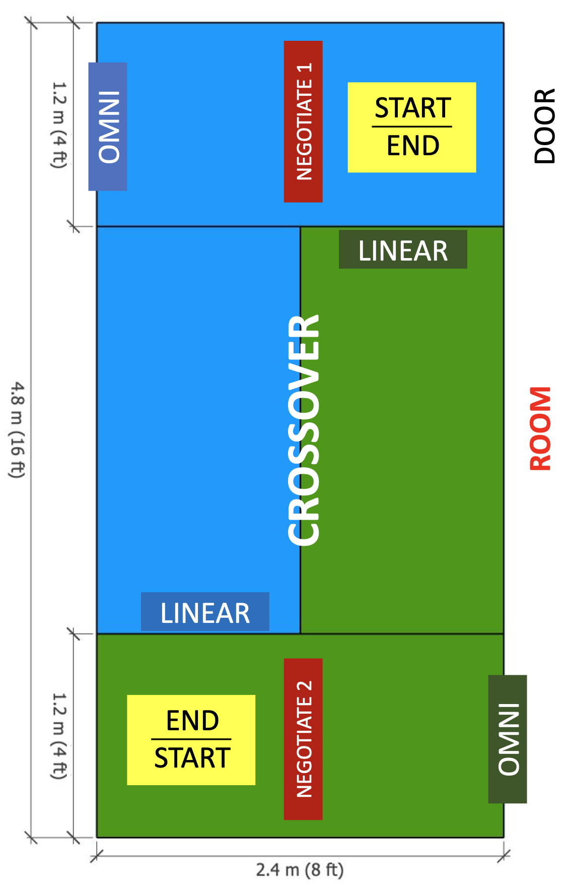
    <figcaption>
      <b>Figura 2.2</b> — Lane Overview: carril de 2.4 × 4.8 m con zonas START/END de 1.2 m en cada extremo, obstáculos NEGOTIATE 1 y 2, aparatos LINEAR y OMNI, y el CROSSOVER al centro. 
      <i>Fuente: Rules 2026D, p. 6 (captura de pantalla del PDF)</i>
    </figcaption>
  </figure>

### Secuencias de misión

**Pruebas de carril único (single lane)** — preliminares, cada carril
se prueba de forma individual para capturar repeticiones estadísticas.

**Secuencias multi-carril (semis/finales)** — 4 secuencias concurrentes
con objetivos distintos, el orden es libre pero sin repetir carriles
hasta completar los 4:

| Secuencia | Carriles |
|---|---|
| 1 | Crossing Ramps, Gravel, Traverse & Center |
| 2 | Cubic Stepfield, K-Rails, Pallet Hurdles |
| 3 | Avoid Holes, Stairs, Doors |
| 4 | Labyrinth (mapeo) |

🚩 **PENDIENTE:** confirmar si TMR usa esta misma estructura de 4
secuencias o una reducida.

## Terrenos y obstáculos

> **Sobre las fotos de referencia:** el PDF 2026D no trae fotos de la
> mayoría de estos terrenos, así que se tomaron de [NIST/ASTM E54.09 —
> Standard Test Methods for Response Robots, Ground Tests](https://www.nist.gov/document/ground-tests-3-maneuvering-and-mobility-2022a2),
> los métodos de prueba en que se basan. Muestran terrenos equivalentes,
> no necesariamente la arena de 2026: las medidas del reglamento van en
> el texto y en el pie de cada figura.

### Crossing Ramps (con discos deslizantes)

- Pendiente/inclinación: 0° o 15°.
- Incluye "slip disks" (discos deslizantes) — mencionados por nombre
  pero sin especificación de tamaño/material en el PDF.

🚩 **PENDIENTE:** especificación exacta de los "slip disks" (dimensión,
material, coeficiente de fricción esperado) — no está detallada en
el PDF, buscar referencia visual o preguntar a la organización.

<table>
<tr>
<td align="center" valign="top">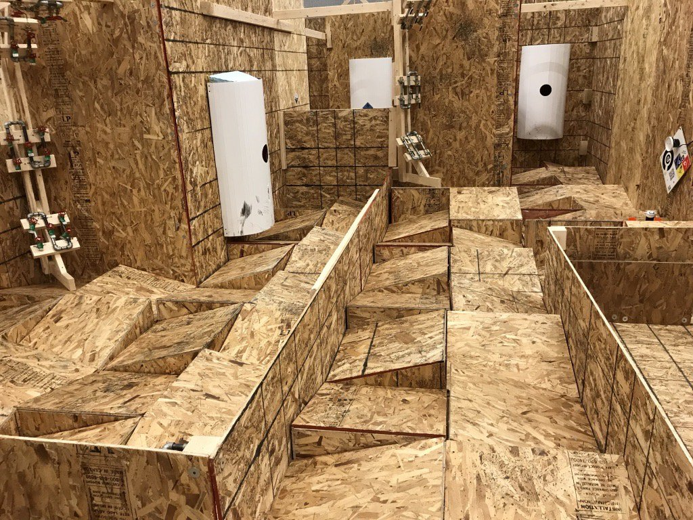</td>
<td align="center" valign="top">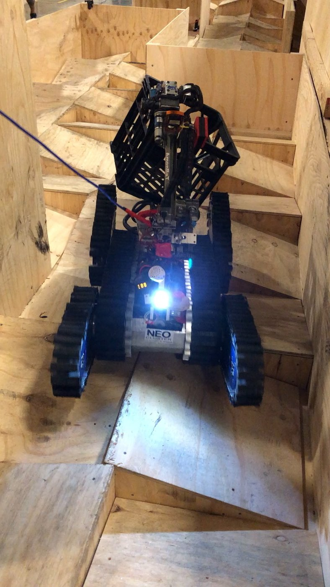</td>
</tr>
<tr>
<td align="center" colspan="2">
  <b>Figura 2.3</b> — Crossing Ramps (referencia NIST). Izquierda: vista del carril. Derecha: un robot cruzando una rampa. En 2026D las pendientes son de 15°|30° con "spinners" opcionales (Arena Layout, p. 2). 
  <i>Fuente: NIST/ASTM E54.09, Ground Tests, diap. 35</i>
</td>
</tr>
</table>

### K-Rails

- Altura: 10 cm (según 2026D) — el PDF también menciona variantes de
  10/20cm dependiendo de la sección de arena.
- Pendiente: 0° o 15°.
- Variantes: "avoid omni", con inclinación, con obstáculos tipo
  "negotiate", con "pinch points".

<table>
<tr>
<td align="center">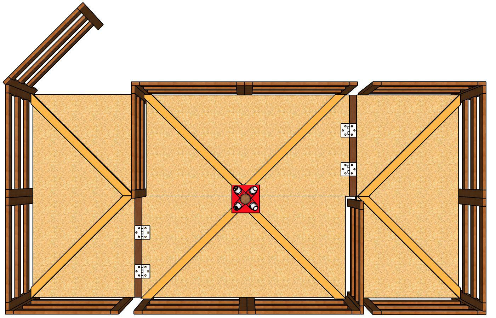</td>
<td align="center">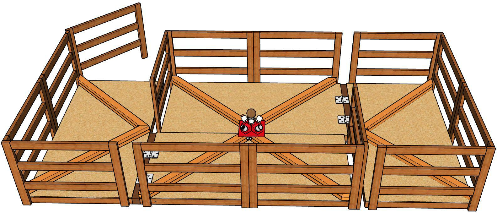</td>
</tr>
<tr>
<td align="center" colspan="2">
  <b>Figura 2.4</b> — K-Rails, 10 cm, variante "avoid omni": un objeto omni (cuadro rojo) queda en el piso al centro. Izquierda: planta. Derecha: isométrica. 
  <i>Fuente: Rules 2026D, p. 7</i>
</td>
</tr>
</table>

<table>
<tr>
<td align="center">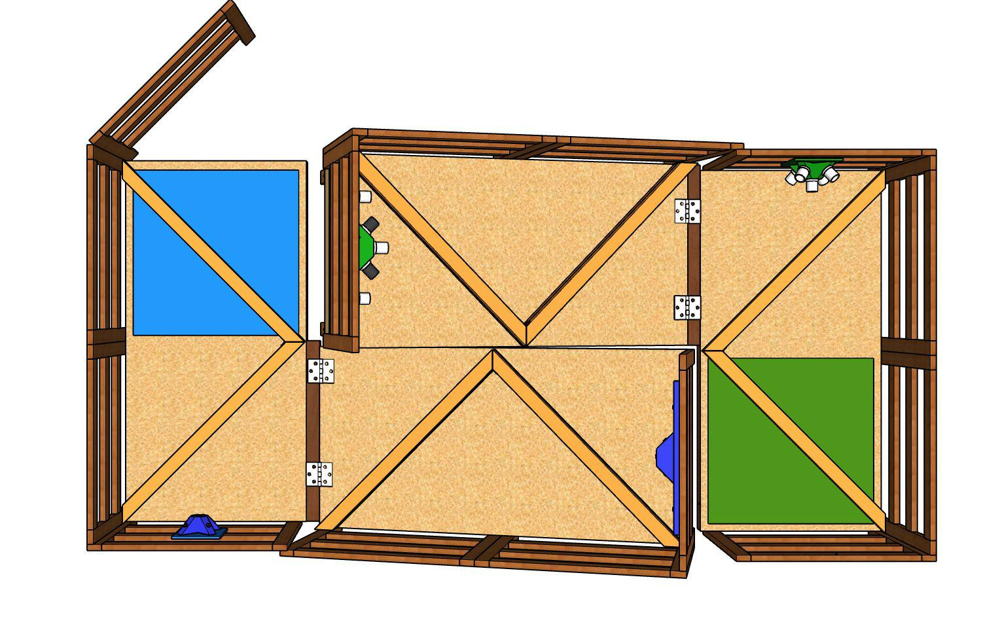</td>
<td align="center">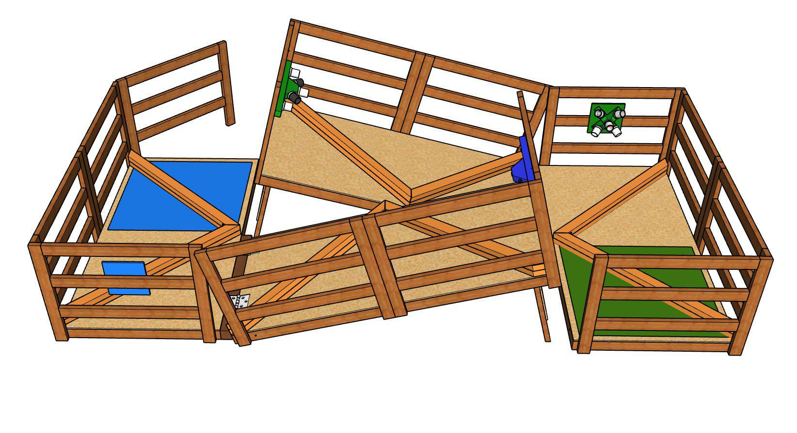</td>
</tr>
<tr>
<td align="center" colspan="2">
  <b>Figura 2.5</b> — K-Rails, 10 cm, con pendiente de 15°. Izquierda: planta. Derecha: isométrica. 
  <i>Fuente: Rules 2026D, p. 7</i>
</td>
</tr>
</table>

<table>
<tr>
<td align="center">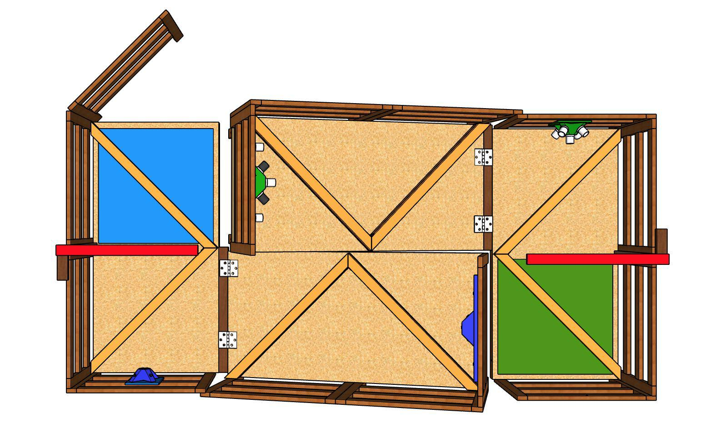</td>
<td align="center">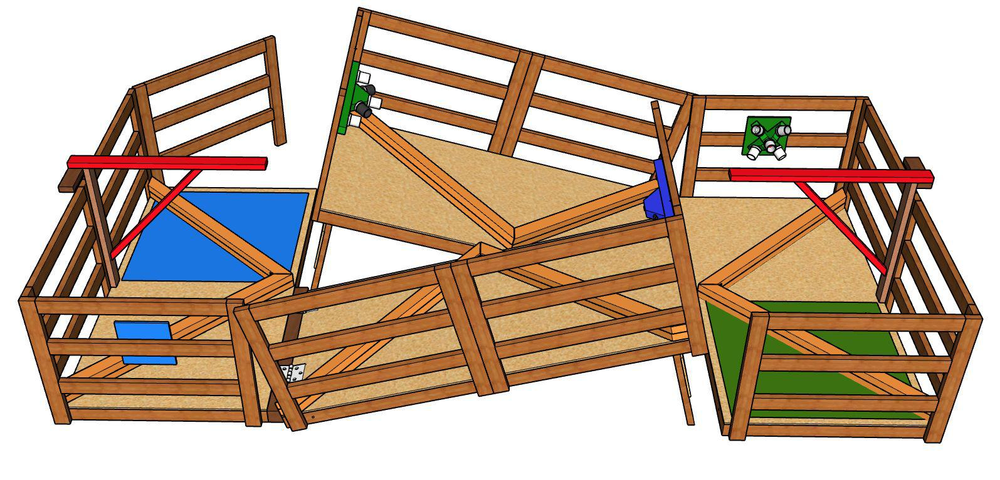</td>
</tr>
<tr>
<td align="center" colspan="2">
  <b>Figura 2.6</b> — K-Rails, 10 cm, pendiente de 15° y obstáculos Negotiate (barras rojas en las zonas de inicio/fin). Izquierda: planta. Derecha: isométrica. 
  <i>Fuente: Rules 2026D, p. 7</i>
</td>
</tr>
</table>

<table>
<tr>
<td align="center">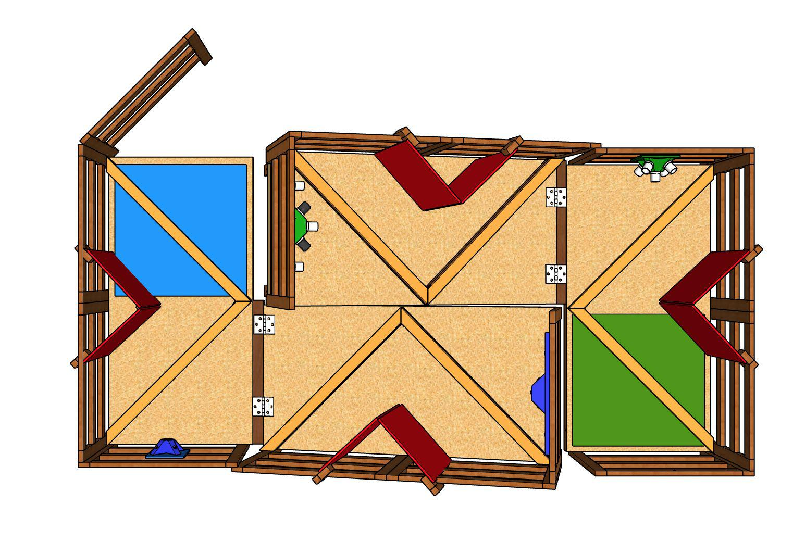</td>
<td align="center">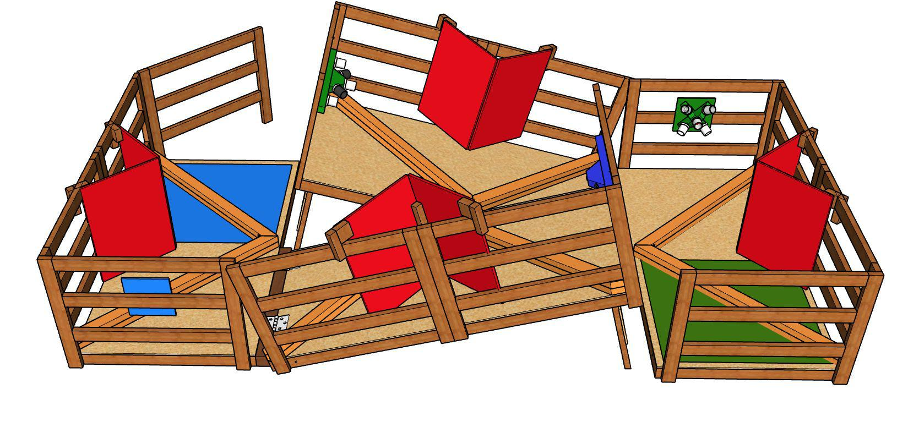</td>
</tr>
<tr>
<td align="center" colspan="2">
  <b>Figura 2.7</b> — K-Rails, 10 cm, pendiente de 15° y "pinch points" (paneles rojos en V que estrechan el paso). Izquierda: planta. Derecha: isométrica. 
  <i>Fuente: Rules 2026D, p. 7</i>
</td>
</tr>
</table>

### Gravel (grava)

- Pendiente: 15°.
- Terreno "inestable" con marcos en X embebidos (según descripción de
  "semi-collapsed approach sequence" del reglamento de TMR/2026D).

🚩 **PENDIENTE:** tipo/tamaño de grava exacto — relevante para que
mecánica calibre tracción y garra de las llantas/orugas.

<table>
<tr>
<td align="center" valign="top">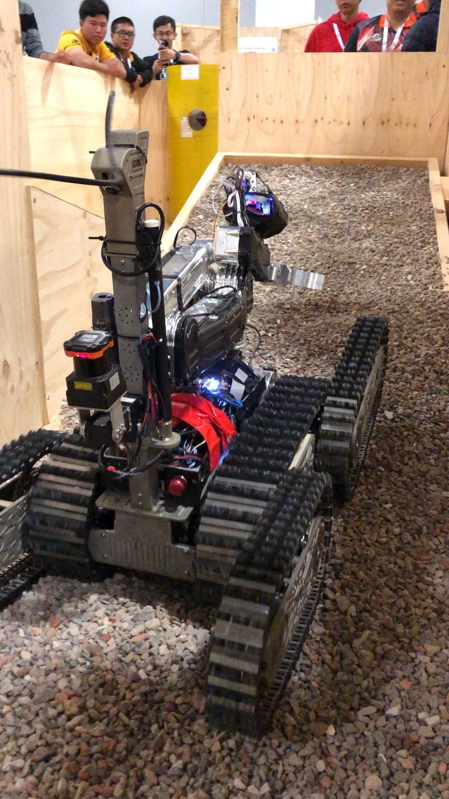</td>
<td align="center" valign="top">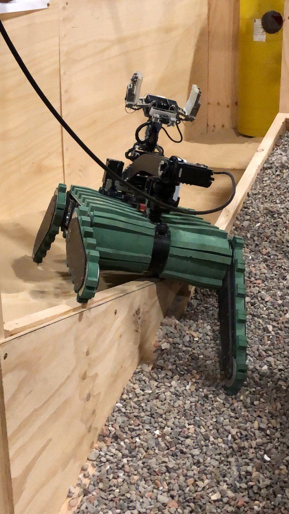</td>
</tr>
<tr>
<td align="center" colspan="2">
  <b>Figura 2.8</b> — Terreno de grava (referencia NIST): dos robots de orugas, uno con flippers, sobre grava suelta. En 2026D es un terreno inestable con marcos en X embebidos (Arena Layout, p. 2). 
  <i>Fuente: NIST/ASTM E54.09, Ground Tests, diap. 37</i>
</td>
</tr>
</table>

### Cubic Stepfield (campo de escalones cúbicos)

- Pendiente: 0° o 15°.
- Terreno de bloques de altura variable que fuerza el chasis a
  adaptarse — común en RoboCupRescue, sin dimensión exacta de los
  cubos especificada en el extracto disponible.

🚩 **PENDIENTE:** dimensiones exactas de los cubos individuales.

  <figure>
    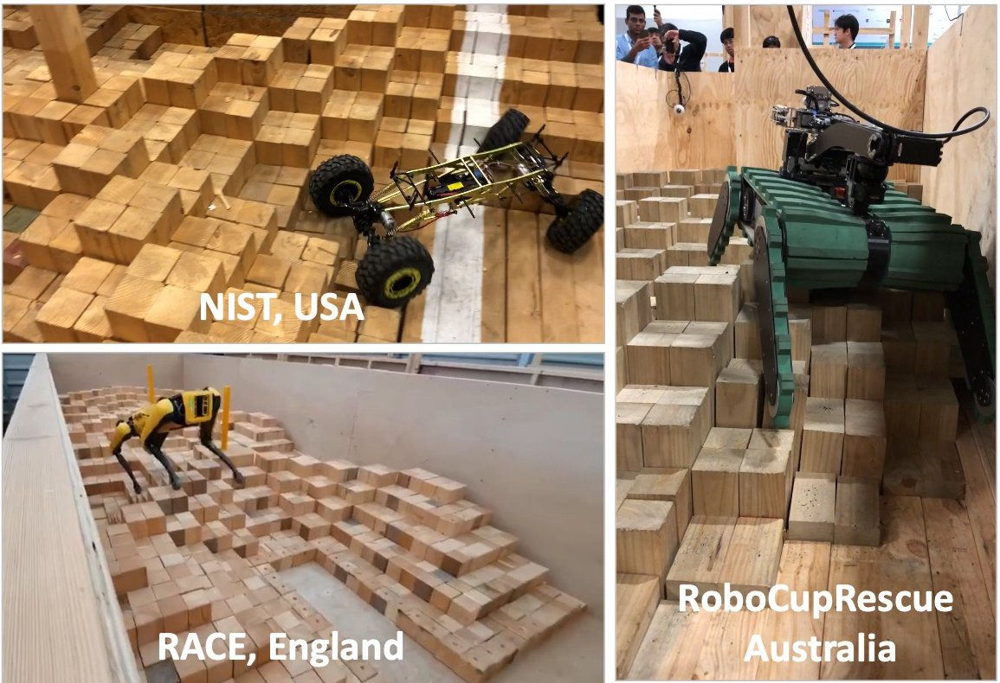
    <figcaption>
      <b>Figura 2.9</b> — Stepfields de cubos de madera en tres instalaciones (NIST, RACE y RoboCupRescue Australia). En 2026D se usan "Half-Cubic Stepfields" con escalones de 15 cm (Arena Layout, p. 2). 
      <i>Fuente: NIST/ASTM E54.09, Ground Tests, diap. 42</i>
    </figcaption>
  </figure>

### Traverse & Center

- Inclinación: 15°, ancho variable.
- Tarea de centrarse dentro de un pasillo de ancho variable mientras
  se avanza en pendiente.

<table>
<tr>
<td align="center">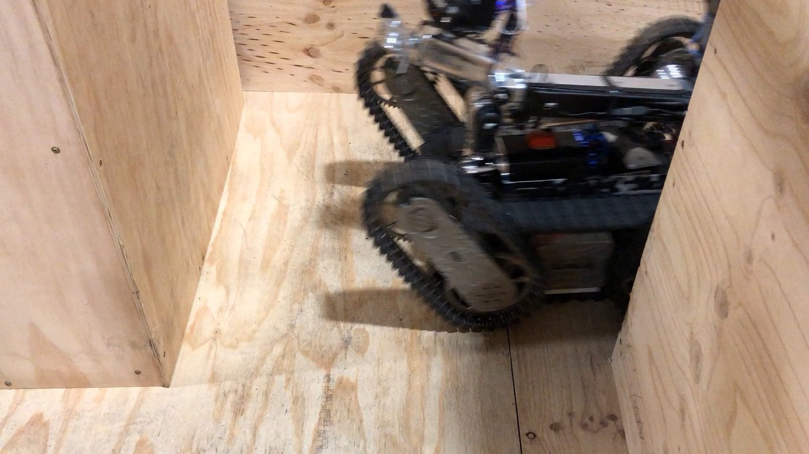</td>
<td align="center">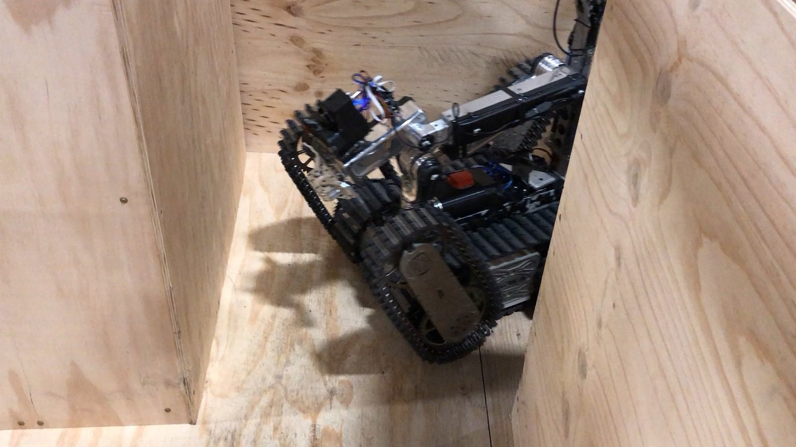</td>
</tr>
<tr>
<td align="center" colspan="2">
  <b>Figura 2.10</b> — Centering (referencia NIST). Izquierda: espacio igual a la diagonal del robot. Derecha: 120% de su ancho, para favorecer la autonomía. En 2026D los pasos se ajustan al ancho del robot + 10 cm (Arena Layout, p. 2). 
  <i>Fuente: NIST/ASTM E54.09, Ground Tests, diap. 15</i>
</td>
</tr>
</table>

### Pallet Hurdles with Pipes

- Elevación: 20 cm.

  <figure>
    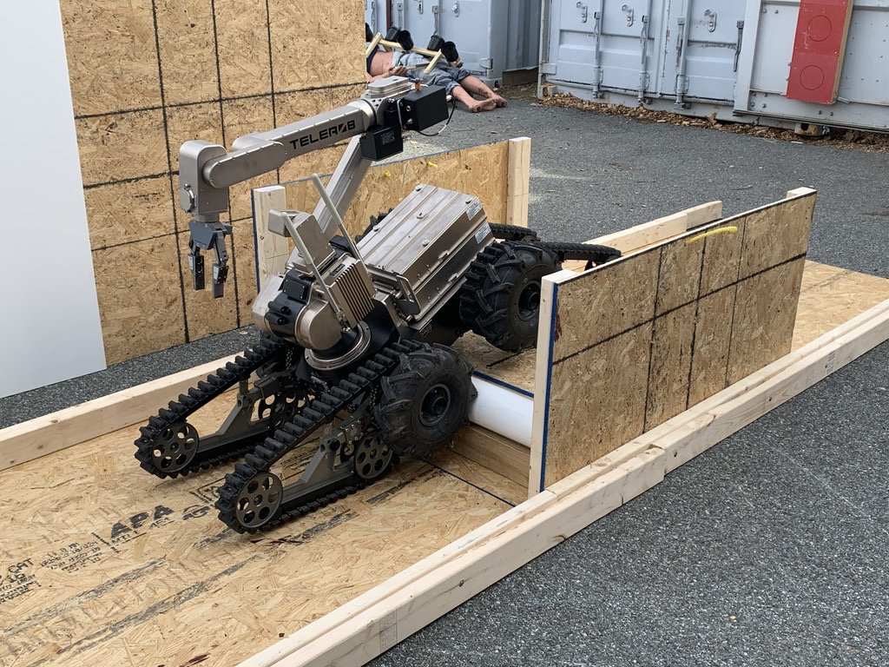
    <figcaption>
      <b>Figura 2.11</b> — Obstáculo tipo hurdle con tubo en el borde (referencia NIST): un robot con brazo lo supera. En 2026D son "Pallets &amp; Pipes" con escalones de 20 cm (Arena Layout, p. 2). 
      <i>Fuente: NIST/ASTM E54.09, Ground Tests, diap. 23</i>
    </figcaption>
  </figure>

### Doors (puertas)

- Tipo perilla de palanca, 90 cm de ancho, con cierre con peso.
- Altura de la perilla: 90-120 cm.

🖼️ **PENDIENTE (imagen):** foto de las puertas. No la incluyen ni el PDF
2026D ni el material de NIST revisado (solo una miniatura ilegible de
"Open Doors").

### Stairs (escaleras)

- Inclinación: 35° / 40° / 45°.
- Variantes con 0, 2 o 4 barreras.
- "Stair debris": escalones de 20cm de altura.

<table>
<tr>
<td align="center" valign="top">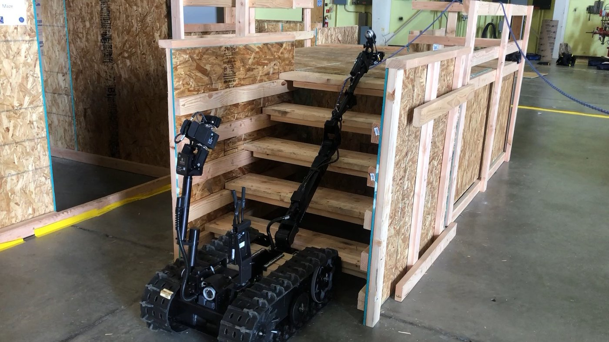</td>
<td align="center" valign="top">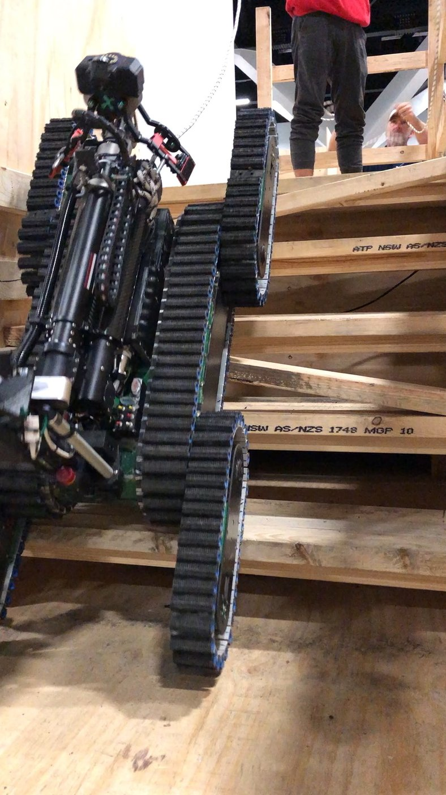</td>
</tr>
<tr>
<td align="center" colspan="2">
  <b>Figura 2.12</b> — Escaleras (referencia NIST). Izquierda: un robot con brazo sube la escalera. Derecha: variante con "debris" (tablones sueltos sobre los escalones). En 2026D el debris es de 20 cm (Arena Layout, p. 2). 
  <i>Fuente: NIST/ASTM E54.09, Ground Tests, diap. 29 y 31</i>
</td>
</tr>
</table>

### Avoid Holes Lane

- Camino elevado a seguir, penaliza tumbar postes: 10s de penalización
  de tiempo por cada uno derribado.

<table>
<tr>
<td align="center" valign="top">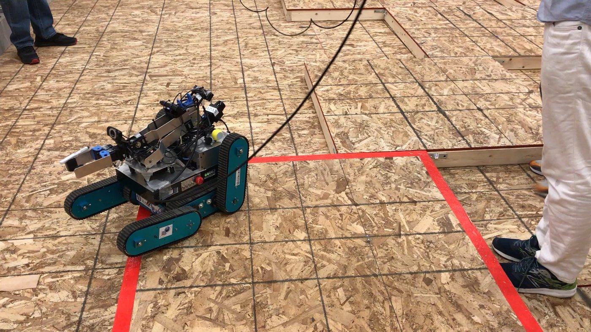</td>
<td align="center" valign="top">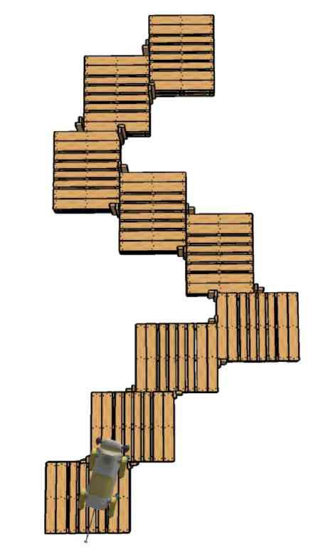</td>
</tr>
<tr>
<td align="center" colspan="2">
  <b>Figura 2.13</b> — Avoid Holes (referencia NIST). Izquierda: un robot junto a una zona marcada con cinta roja. Derecha: trazado en planta de un camino de palets con inicio/fin; hay que seguirlo sin salirse, con cambios de altura. En 2026D son 10 cm de elevación y 5 puertas de 90 cm de ancho (Arena Layout, p. 2). 
  <i>Fuente: NIST/ASTM E54.09, Ground Tests, diap. 18 y 19</i>
</td>
</tr>
</table>

## Desafíos adicionales (puntos extra)

Retos opcionales que se hacen durante los carriles; los puntos están en
la Mission Form del PDF.

### Carry a payload (pipestar)

Recoger el objeto con el gripper —antes de la misión o durante ella,
ante un juez— y llevarlo en todos los carriles. Puede ser un
*pipestar* u otro objeto anunciado al inicio de la competencia. Peso
máximo y ancho de gripper en
[`06-puntuacion-premios.md`](./06-puntuacion-premios.md).

<table>
<tr>
<td align="center">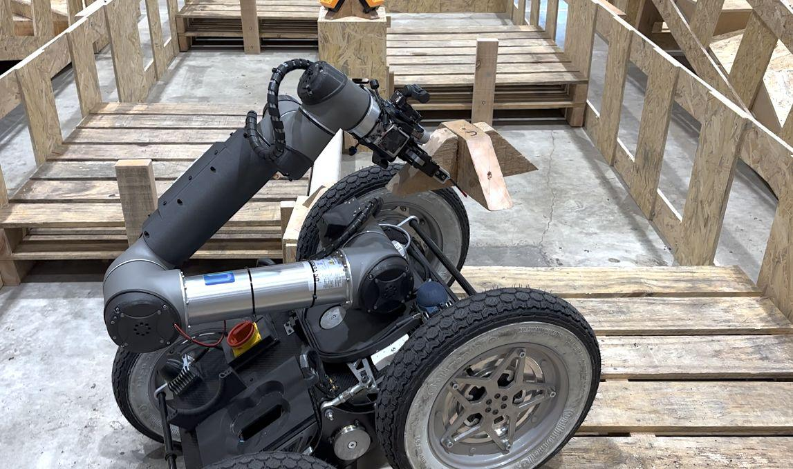</td>
<td align="center">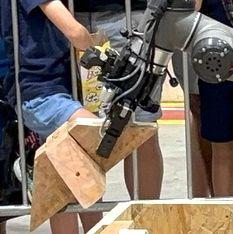</td>
</tr>
<tr>
<td align="center" colspan="2">
  <b>Figura 2.14</b> — Carry a pipestar. Izquierda: robot con brazo cruzando el carril con la carga. Derecha: detalle del gripper sujetándola. 
  <i>Fuente: Rules 2026D, p. 4</i>
</td>
</tr>
</table>

### Negotiate Leaning Obstacles

Barras inclinadas que hay que cruzar sin tocar. Están magnetizadas, así
que cualquier barra tocada cae (un golpe fuerte a las paredes también
las tira). Las caídas quedan como escombro hasta que el robot pasa a la
siguiente repetición o terreno. Puede haber puntos extra por las barras
que sigan en pie en cada repetición.

<table>
<tr>
<td align="center">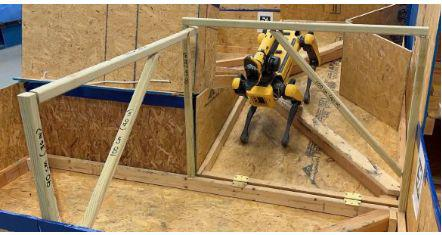</td>
<td align="center">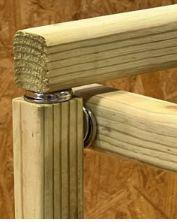</td>
</tr>
<tr>
<td align="center" colspan="2">
  <b>Figura 2.15</b> — Negotiate Leaning Obstacles. Izquierda: un robot cuadrúpedo cruza entre las barras inclinadas. Derecha: detalle de la unión de una barra (magnetizada, por eso cae al tocarla). 
  <i>Fuente: Rules 2026D, p. 4</i>
</td>
</tr>
</table>

### Radio Comms Degradation

Misión bajo condiciones de red cada vez peores, usando la Radio
Degradation Box oficial. Parámetros y referencia de la caja en
[`07-degradacion-comunicaciones.md`](./07-degradacion-comunicaciones.md).

  <figure>
    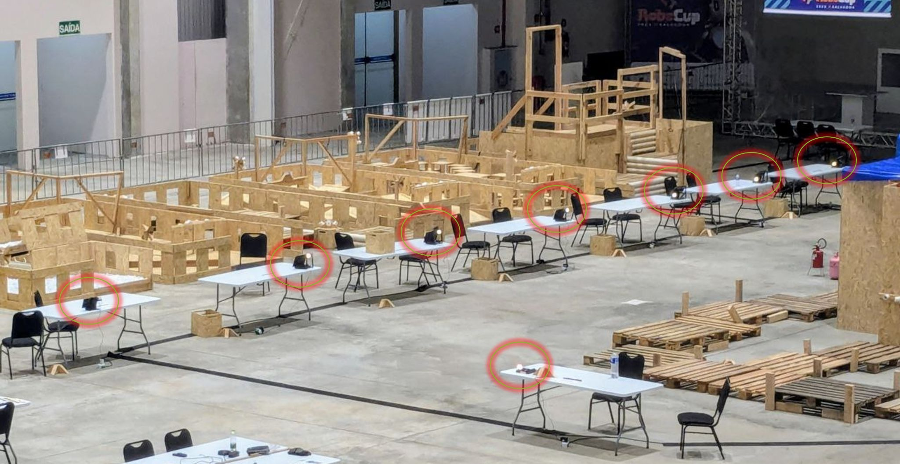
    <figcaption>
      <b>Figura 2.16</b> — Radio Comms Degradation Setup: los equipos circulados en rojo están sobre las mesas, frente a la arena. 
      <i>Fuente: Rules 2026D, p. 4</i>
    </figcaption>
  </figure>

## Puntuación de Mobility

- Recorrido teleoperado exitoso (ida o vuelta): **1 punto**.
- Recorrido autónomo exitoso, sin intervención (hands-off): **15
  puntos** (2026D) — ver diferencia con 2026A en
  [`08-diferencias-version.md`](./08-diferencias-version.md).
- El operador puede tomar control a mitad de un intento autónomo para
  terminarlo teleoperado (1 punto) y reintentar autónomo la siguiente
  repetición.
- Puntos extra disponibles por: cargar un payload, "Negotiate Leaning
  Obstacles", y degradación de comunicaciones activa (ver
  [`07-degradacion-comunicaciones.md`](./07-degradacion-comunicaciones.md)).
- Puntajes de mobility se normalizan contra el máximo alcanzado por
  cualquier equipo en ese carril.

---
← Anterior: [General](./01-general.md) | → Siguiente: [Destreza](./03-destreza.md)
