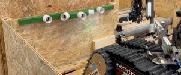
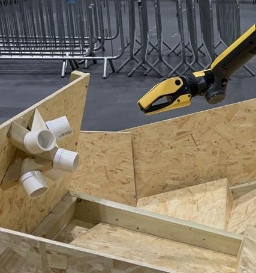
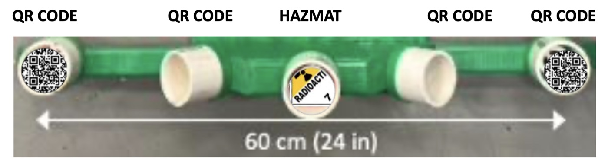
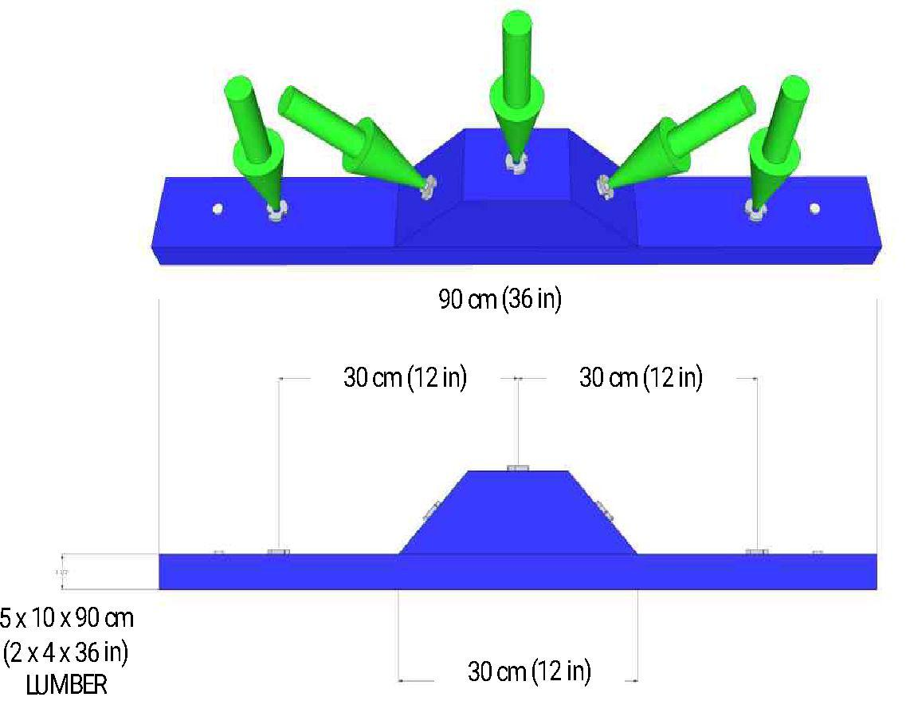
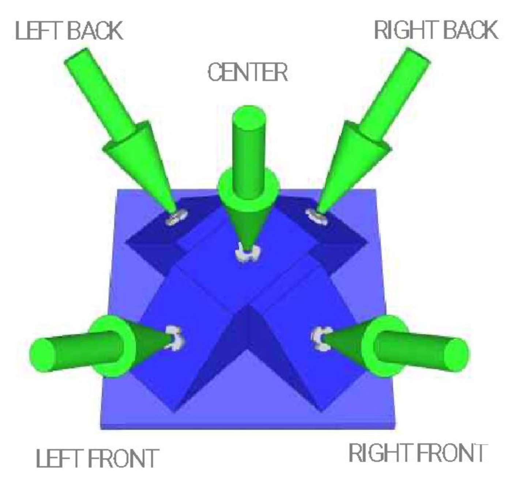
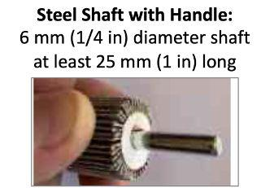
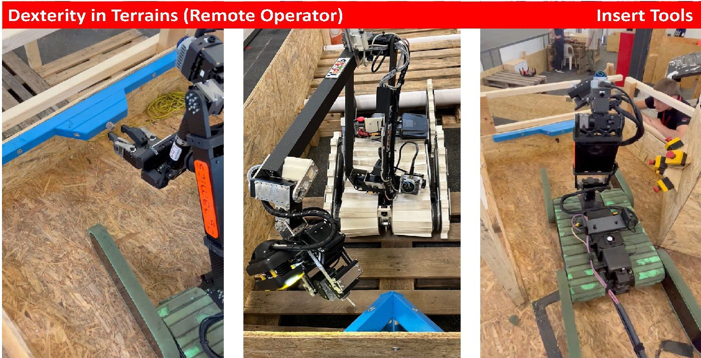
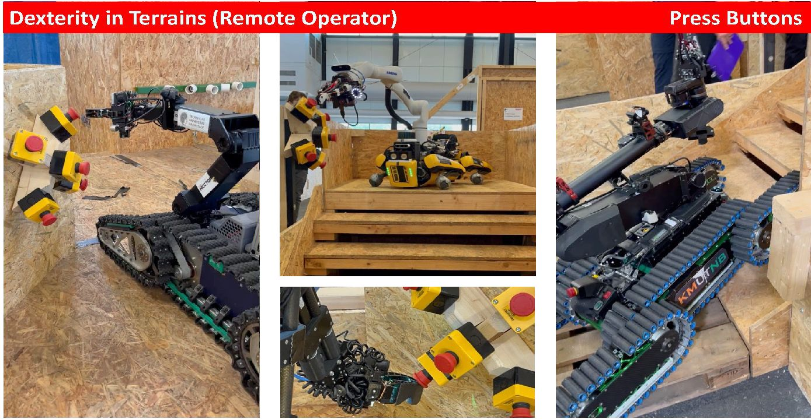
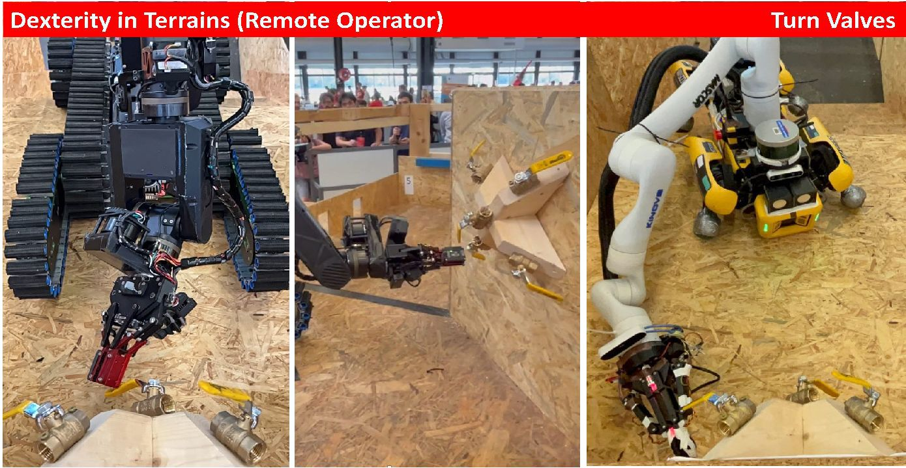

# Destreza

← [Índice](./README.md) | ← [Movilidad](./02-movilidad.md)

Pueden realizarse con **cualquier parte del robot** — una pata
presionando un botón cuenta igual que un gripper dedicado. Las tareas
de inspección pueden hacerse con una cámara montada en el chasis, sin
necesidad de manipulador.

> **Requisito previo:** para puntuar cualquier tarea de destreza, el
> robot debe haber anotado primero al menos 2 puntos en la porción de
> mobility de esa misma prueba.

## Tareas de clasificación (lineales/omni)

| Tarea | Cuándo aplica | Puntos lineal | Puntos omni |
|---|---|---|---|
| Inspect | Prelims/Semis/Finales | 1 | 2 |
| Touch | Solo preliminares (más fácil) | 2 | 4 |
| Insert | Solo semis/finales (más difícil) | 3 | 6 |

- **Touch**: contacto sostenido de la punta de una herramienta con el
  interior de un agujero, en cualquier orientación.
- **Insert**: penetración perpendicular de al menos 25mm (1 pulgada).
- Diámetro del eje de la herramienta: 6mm (¼ pulgada).
- Los rieles lineales se montan a 60cm de altura en la pared; los
  objetos omni pueden ir a 60cm o al piso.

### Inspect (objetos verdes)

<table>
<tr>
<td align="center" valign="top">
  <figure>
    
    <figcaption>
      <b>Figura 3.1</b> — Riel lineal de inspección, montado en la pared a 60 cm. 
      <i>Fuente: Rules 2026D, p. 13</i>
    </figcaption>
  </figure>
</td>
<td align="center" valign="top">
  <figure>
    
    <figcaption>
      <b>Figura 3.2</b> — Aparato omni de inspección: tubos en varias orientaciones, no alineados. 
      <i>Fuente: Rules 2026D, p. 13</i>
    </figcaption>
  </figure>
</td>
</tr>
</table>

  <figure>
    
    <figcaption>
      <b>Figura 3.3</b> — Objetivos de un riel lineal de inspección: cuatro códigos QR y una etiqueta hazmat en 60 cm (24 in). 
      <i>Fuente: Rules 2026D, p. 13 (captura de pantalla del PDF)</i>
    </figcaption>
  </figure>

### Touch e Insert (aparatos azules)

<table>
<tr>
<td align="center" valign="top">
  <figure>
    
    <figcaption>
      <b>Figura 3.4</b> — Aparato lineal: tablón de 5 × 10 × 90 cm con cinco puntos, tres de ellos sobre un bloque elevado de 30 cm. 
      <i>Fuente: Rules 2026D, p. 14</i>
    </figcaption>
  </figure>
</td>
<td align="center" valign="top">
  <figure>
    
    <figcaption>
      <b>Figura 3.5</b> — Aparato omni: cinco puntos (LEFT/RIGHT BACK, CENTER, LEFT/RIGHT FRONT) que se alcanzan desde ángulos distintos. 
      <i>Fuente: Rules 2026D, p. 14 (captura de pantalla del PDF)</i>
    </figcaption>
  </figure>
</td>
</tr>
</table>

  <figure>
    
    <figcaption>
      <b>Figura 3.6</b> — Herramienta: eje de acero con mango, de 6 mm (¼ in) de diámetro y al menos 25 mm (1 in) de largo. 
      <i>Fuente: Rules 2026D, p. 14</i>
    </figcaption>
  </figure>

  <figure>
    
    <figcaption>
      <b>Figura 3.7</b> — Ejemplos de "Insert Tools" operados de forma remota dentro de los terrenos. 
      <i>Fuente: Rules 2026D, p. 14</i>
    </figcaption>
  </figure>

## Tareas operacionales (solo semis/finales, solo omni)

| Tarea | Puntos (2026D) |
|---|---|
| Push E-Stops | 8 |
| Rotate Valves (Close Valves) | 10 |
| Insert Keys | 10 |

Más difíciles por requerir fuerza, fricción o precisión adicional.

  <figure>
    
    <figcaption>
      <b>Figura 3.8</b> — Ejemplos de "Press Buttons" (los E-Stops de la tabla), con brazo o pata, en terreno. 
      <i>Fuente: Rules 2026D, p. 15</i>
    </figcaption>
  </figure>

  <figure>
    
    <figcaption>
      <b>Figura 3.9</b> — Ejemplos de "Turn Valves": válvulas de bola sobre soportes de madera, en piso y pared. 
      <i>Fuente: Rules 2026D, p. 15</i>
    </figcaption>
  </figure>

## Multiplicadores de autonomía en Destreza

| Modo | Descripción | Multiplicador (2026D) |
|---|---|---|
| TA | Aproximación teleoperada, manipulación autónoma | x10 |
| AA | Aproximación y manipulación completamente autónomas | x20 |

El intento debe iniciar rodeando al menos una esquina antes de entrar
al pasillo con la tarea de destreza.

🚩 **PENDIENTE (depende de decisión de mecánica sin resolver):** toda
esta sección asume que el robot cuenta con algún tipo de manipulador
(brazo o mecanismo dedicado). Mientras el equipo de mecánica no
confirme si habrá brazo o riel, no se puede diseñar el software de
control de manipulación equivalente a `positioning/CapsuleSequencer`
para destreza, si aplica.

---
← Anterior: [Movilidad](./02-movilidad.md) | → Siguiente: [Caja de víctima](./04-caja-victima.md)
