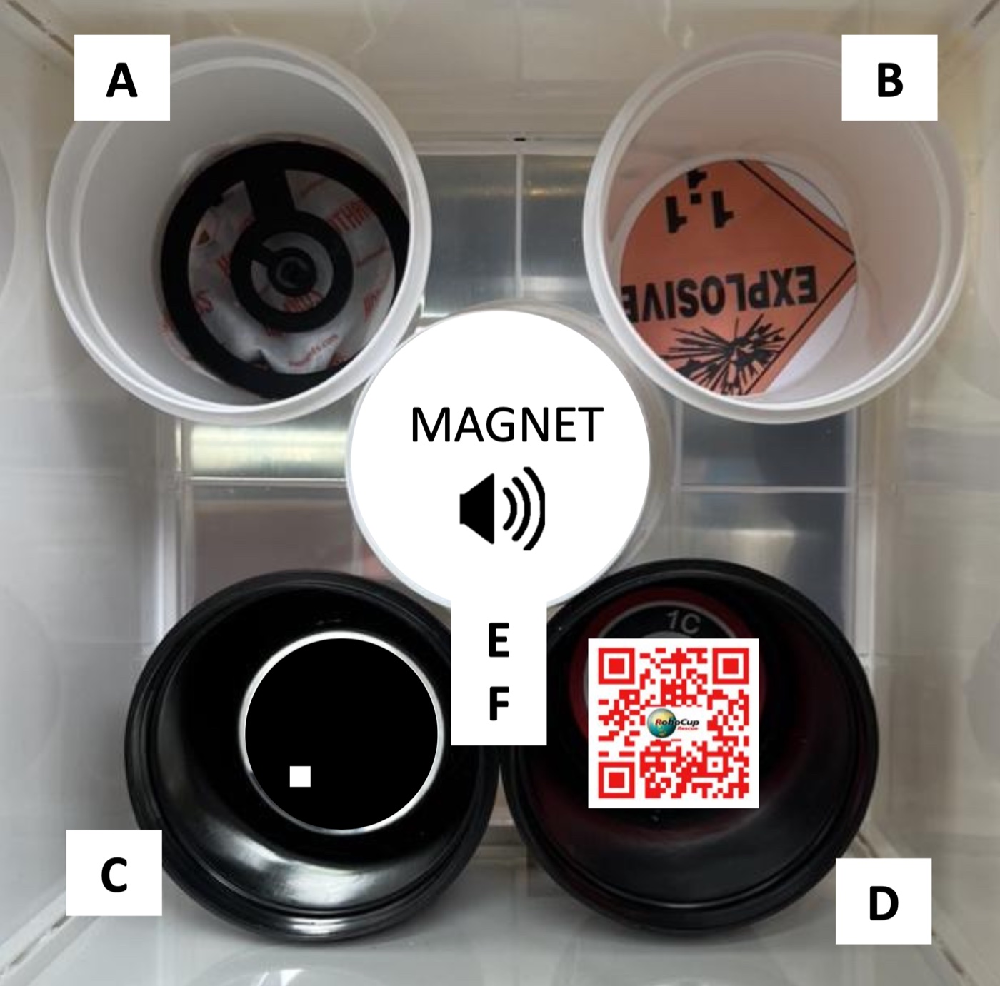

# Caja de víctima (Victim Crate)

← [Índice](./README.md) | ← [Destreza](./03-destreza.md)

  <figure>
    
    <figcaption>
      <b>Figura 4.1</b> — Victim crate vista desde arriba, con la letra de cada tarea de sensado. 
      <b>A</b> Térmica · <b>B</b> Hazmat · <b>C</b> Movimiento · <b>D</b> QR · <b>E</b> Imán · <b>F</b> Audio 
      <i>Fuente: Rules 2026D, p. 12 (captura de pantalla del PDF)</i>
    </figcaption>
  </figure>

## Reglas generales de la caja

- Requisito previo: al menos 2 puntos en mobility y 2 en destreza de
  esa prueba.
- La caja se coloca en cualquier parte del carril, siempre en posición
  vertical.
- Puede usarse cualquier sensor del robot, no uno dedicado
  exclusivamente a esto.
- Tras un reinicio, el manipulador (si existe) debe volver a posición
  guardada. Si el manipulador está roto, no se permite colocarlo
  manualmente sobre la caja para puntuar.

## Thermal Image Acuity (5 pts)

- **Sensor necesario:** cámara térmica.
- **Objetivo físico:** calentador de mano con "Cs concéntricas"
  impresas en 3D.
- **Proceso:** mostrar en pantalla del operador la firma de calor en
  el patrón de las Cs, "2 niveles de profundidad".

🚩 **PENDIENTE:** qué significa exactamente "2 niveles de profundidad"
en términos de criterio de éxito medible, y qué formato de despliegue
en pantalla se espera (¿imagen cruda, imagen procesada con overlay,
ambas?). No especificado en el PDF disponible.

## Partial Image Recognition — Hazmat (4 pts)

- **Sensor necesario:** cámara (detección visual).
- **Objetivo físico:** etiquetas hazmat aleatorias de un conjunto
  conocido.
- **Proceso:** detección **autónoma** de la etiqueta; mostrar recuadro
  delimitador (bounding box) alrededor de la etiqueta y el nombre de
  la etiqueta.

🚩 **PENDIENTE:** el "conjunto conocido" de etiquetas hazmat no viene
listado en el extracto disponible — necesario para entrenar cualquier
modelo de detección. Buscar el anexo con las etiquetas oficiales.

## Motion Detection (4 pts)

- **Sensor necesario:** cámara.
- **Objetivo físico:** disco giratorio con un objetivo (forma).
- **Proceso:** detección **autónoma** del objetivo en movimiento,
  mostrar recuadro delimitador y seguimiento mientras gira 360°.

## Proximity Sampling — Imán (3 pts)

- **Sensor necesario:** magnetómetro en la punta de la herramienta o
  manipulador.
- **Proceso:** detectar la presencia del imán. La fuerza del imán varía
  según el país sede — cualquier sensor de bajo costo capaz de
  detectar un imán doméstico es suficiente según el propio reglamento.

Esta es la tarea que mejor coincide con lo ya diseñado en
`firmware/sensors` (`MagnetSensor`).

## QR Code Acuity (2 pts)

- **Sensor necesario:** cámara/lector QR.
- **Proceso:** decodificación **autónoma** del QR; mostrar el texto
  decodificado en pantalla del operador.

Esta tarea ya está resuelta en el código: `robot_ws` decodifica el QR a
bordo (`robot_vision/detectors/qr_detector.py`, con `pyzbar`) y se pide
bajo demanda con el Action `/run_test` (`test_id: 'qr'`). El reglamento
exige que sea **autónomo**, por eso no se decodifica en el `dashboard`
del operador (rompería el requisito de autonomía) ni en un Arduino.

## 2-Way Audio Acuity (2 pts, 2026D)

- **Sensor necesario:** micrófono + bocina.
- **Objetivo físico:** reproductor MP3 con una secuencia alfanumérica.
- **Proceso:** detectar al menos una línea de la secuencia, tanto en
  la estación del operador como en el robot. No requiere full-duplex —
  basta con medio-duplex (una vía a la vez). El sistema debe poder
  transmitir la voz del operador al robot con solo presionar un botón.

🚩 **PENDIENTE:** formato exacto de "detectar la secuencia" — ¿se
espera transcripción automática (speech-to-text / reconocimiento de
dígitos), o basta con que el humano operador la escuche y la
transcriba de oído? El reglamento no lo aclara.

## Visual/Color Acuity — solo en borrador 2026A (no en 2026D)

- Aparecía en el borrador con 1 punto, objetivo "Cs concéntricas" con
  un hueco a identificar "3 niveles de profundidad". No está presente
  en la versión 2026D revisada — **no implementar** a menos que se
  confirme que TMR sí la incluye.

🚩 **PENDIENTE:** confirmar con TMR si esta tarea aplica.

---
← Anterior: [Destreza](./03-destreza.md) | → Siguiente: [Mapeo](./05-mapeo.md)
