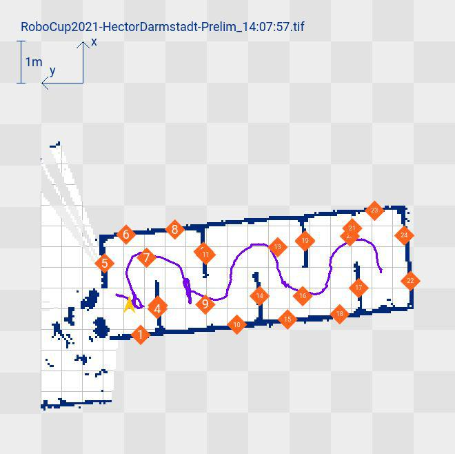

# Mapeo y detección de objetos

← [Índice](./README.md) | ← [Caja de víctima](./04-caja-victima.md)

## Misión y tiempos

- 20 minutos para generar y entregar mapas del laberinto.
- Una corrida de mapeo inicia desde una posición designada y termina
  cuando el mapa se guarda y se limpia en el robot.
- Se permiten múltiples corridas de mapeo dentro del tiempo asignado,
  cada una debe iniciar desde la misma posición designada.
- Si un integrante del equipo entra al área o interactúa con el robot
  durante un intento, se considera reinicio (excepto manejo de cable).

## Formato de entrega — Mapa 2D (GeoTIFF)

- **Obligatorio de entregar, pero no se puntúa directamente** — se usa
  para visualizar otras métricas.
- Implementación de referencia disponible para ROS: `hector_geotiff`.
- Nombre de archivo: `RoboCup[Año]-[NombreEquipo]-[Misión].tiff`.

**Especificación de elementos visuales (colores exactos, RGB):**

| Elemento | Color / especificación |
|---|---|
| Nombre de archivo | Azul oscuro (0,44,207), esquina superior izquierda |
| Escala del mapa | Azul oscuro (0,50,140), línea de exactamente 1 metro, esquina superior derecha |
| Orientación (ejes X/Y) | Azul oscuro (0,50,140), flechas de ~50cm, sistema de mano derecha (X arriba, Y a la izquierda) |
| Área no explorada | Cuadrícula tipo tablero de ajedrez gris claro/oscuro, celdas de 100cm |
| Área explorada | Cuadrícula negra de 50cm, líneas de ~1cm |
| Posición inicial del robot | Flecha verde (0,240,0), apuntando siempre hacia arriba del mapa |
| Paredes/obstáculos | Azul oscuro (0,40,120) |
| Área buscada | Gradiente blanco de confianza (128,128,128 a 255,255,255) |
| AprilTag | Círculo amarillo sólido (255,200,0), ~35cm diám., texto blanco con el número de etiqueta |
| Hazmat | Diamante naranja sólido (255,100,30), ~30cm, texto blanco con 2 primeras letras |
| Objeto real | Diamante rojo sólido (240,10,10), ~30cm, texto blanco con 2 primeras letras |
| Ruta del robot | Línea magenta (120,0,140), ~2cm de grosor |

> El reglamento permite desviarse de este formato exacto si mejora la
> claridad, siempre que se incluya la misma información (escala,
> detecciones, obstáculos, ruta). El objetivo es un mapa 2D limpio y
> útil para operación de campo, no necesariamente pixel-perfecto al
> spec.

<div align="center">
  <figure>
    
    <figcaption>
      <b>Figura 5.1</b> — Mapa 2D de ejemplo (equipo Hector Darmstadt, RoboCup 2021): nombre de archivo, escala de 1 m y ejes X/Y arriba a la izquierda; paredes azules, ruta morada y detecciones numeradas.<br>
      <i>Fuente: Rules 2026D, p. 22</i>
    </figcaption>
  </figure>
</div>

## Formato de entrega — Nube de puntos 3D (PLY)

- Archivo ASCII, formato de encabezado PLY estándar.
- Campos mínimos: `x`, `y`, `z` (float).
- Campos opcionales: color RGB, información de calor, normales de
  punto, escalar de confianza — dan multiplicador de bonus si se
  incluyen de forma sensata.
- **Escala obligatoria en metros** — 1 unidad = 1 metro real. Escala
  incorrecta penaliza severamente el puntaje.
- Origen (0,0,0): posición inicial del robot, marcada en el piso;
  específicamente el centro del frente del robot a nivel de piso. El
  robot apunta en dirección +Y al inicio, eje vertical es Z.

```
ply
format ascii 1.0
comment {Nombre del equipo}
comment {Hora de inicio}
comment {Número de misión}
element vertex {Número de vértices}
property float x
property float y
property float z
property uchar red
property uchar green
property uchar blue
property float nx
property float ny
property float nz
property float temp
property float confidence
end_header
{DATOS}
```

## CSV de objetos identificados

Nombre de archivo: `RoboCup[Año]-[Equipo]-[Misión]-[HoraInicio]-pois.csv`

Encabezado del archivo (7 líneas entre comillas): nombre del equipo,
país, fecha de inicio, hora de inicio, número de misión.

Columnas del cuerpo: `detection, time, type, name, x, y, z, robot, mode`

| Campo | Descripción |
|---|---|
| `detection` | Contador entero único, también impreso en el mapa GeoTIFF |
| `time` | Marca de tiempo del hallazgo |
| `type` | `ar_code`, `hazmat_sign`, `real_object`, o `heat_sig` |
| `name` | ID único de la detección |
| `x, y, z` | Coordenadas en metros |
| `robot` | Nombre del robot que encontró el objeto |
| `mode` | `A` (autónomo) o `T` (teleoperado) |

Solo se cuenta **una** detección por objeto único — duplicados se
descartan (se usa la primera instancia).

🚩 **PENDIENTE:** lista oficial de nombres de objetos — el reglamento
indica que "se proveerá durante la competencia", no está en el PDF.

## Puntuación de mapeo (2026D)

- Multiplicador según nivel de intervención: teleoperado x1, con
  degradación de comunicaciones x2, completamente autónomo x5.
- Nota: 2026A usaba una estructura distinta (bonus de x4 solo al
  mapeo) — ver [`08-diferencias-version.md`](./08-diferencias-version.md).

🚩 **PENDIENTE:** confirmar con TMR si aplican las métricas exactas de
Global Error / Coverage / Localization Error del reglamento
internacional (fórmulas `CV * (1/(1+GE)) * Bonus` y `DS/(1+LE)`), o si
TMR usa un criterio de evaluación más simple dado que es un torneo de
menor escala.

🚩 **PENDIENTE:** formato de exportación GeoTIFF/PLY/CSV desde
`robot_core` — pendiente de implementación futura, no solo de
documentación.

---
← Anterior: [Caja de víctima](./04-caja-victima.md) | → Siguiente: [Puntuación y premios](./06-puntuacion-premios.md)
